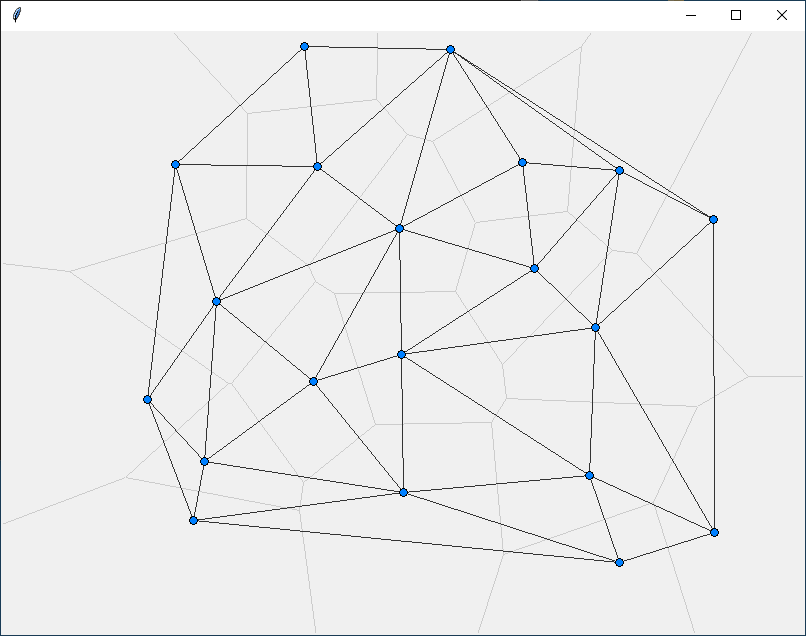
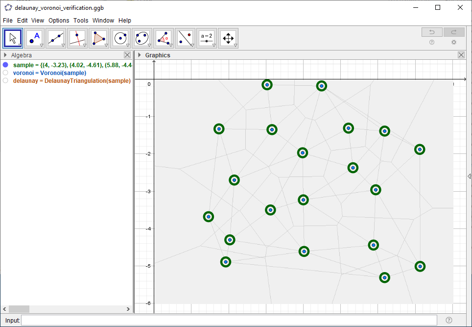
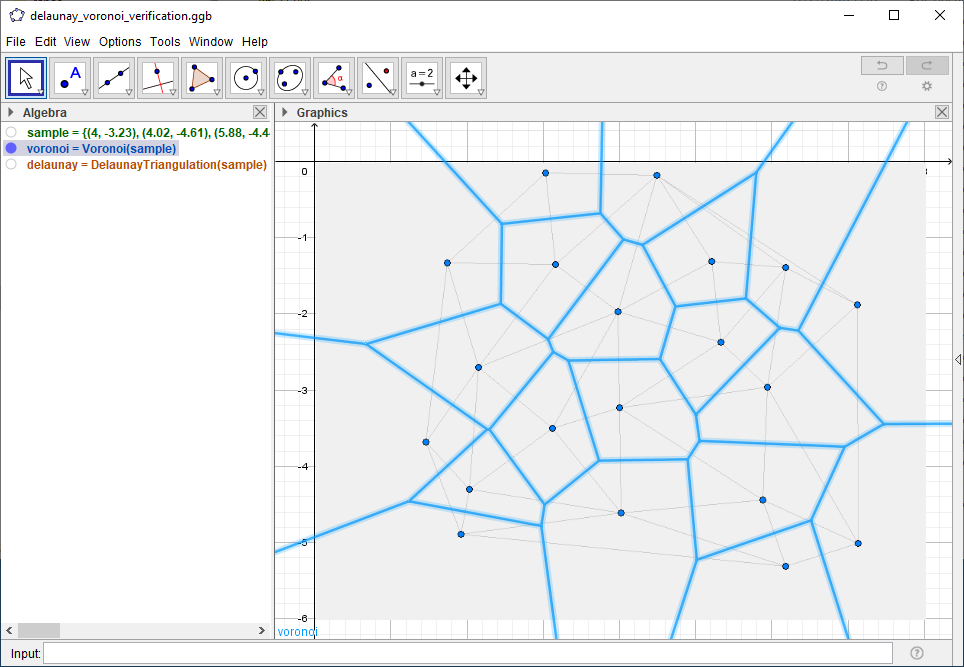
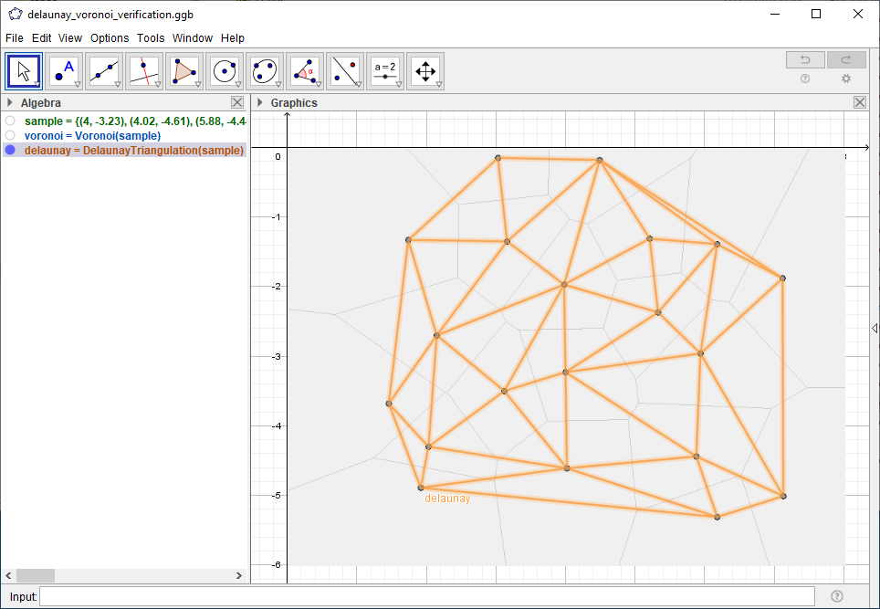
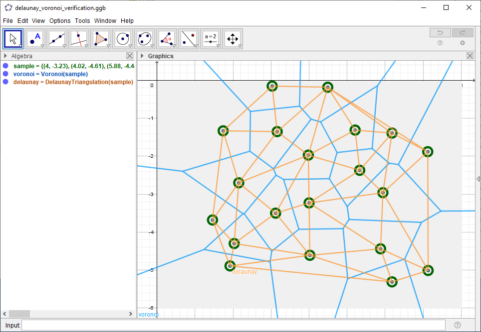

# Delaunay / Voronoi

## Description

Generating [delaunay triangulation](https://en.wikipedia.org/wiki/Delaunay_triangulation) using [Bowyer-Watson algorithm](https://en.wikipedia.org/wiki/Bowyer%E2%80%93Watson_algorithm) then generating [voronoi diagram](https://en.wikipedia.org/wiki/Voronoi_diagram) from [delaunay](https://en.wikipedia.org/wiki/Delaunay_triangulation#Relationship_with_the_Voronoi_diagram)

## Usage

* Click to add points
* Press `c` to clear all points
* Press `d` to change style of delaunay (hidden, light, dark)
* Press `v` to change style of voronoi (hidden, light, dark)
* Press `p` to toggle visibility of points

## Verification

Verifying sample points using [GeoGebra Classic 5](https://www.geogebra.org/download)

### Sample Points

### Voronoi

### Delaunay

### Sample Points + Voronoi + Delaunay

